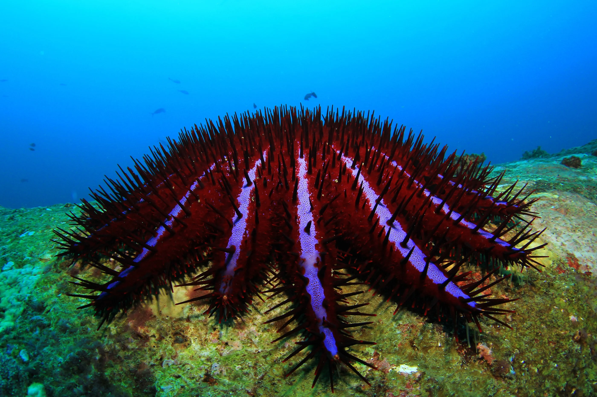

**Goal of the Competition**

The goal of this competition is to accurately identify starfish in real-time by building an object detection model trained on underwater videos of coral reefs.

Your work will help researchers identify species that are threatening Australia's Great Barrier Reef and take well-informed action to protect the reef for future generations.

**Context**

Australia's stunningly beautiful Great Barrier Reef is the world’s largest coral reef and home to 1,500 species of fish, 400 species of corals, 130 species of sharks, rays, and a massive variety of other sea life.

Unfortunately, the reef is under threat, in part because of the overpopulation of one particular starfish – the coral-eating crown-of-thorns starfish (or COTS for short). Scientists, tourism operators and reef managers established a large-scale intervention program to control COTS outbreaks to ecologically sustainable levels.

pic credits(2018 Richard Whitcombe/Shutterstock @LiesurePro)

They occur naturally on reefs throughout the Indo-Pacific region, and when conditions are right, they can reach plague proportions and devastate hard coral communities. These crown-of-thorns starfish are a major cause of coral loss on the Great Barrier Reef, after coral bleaching.

**Goal of this git repository**
1. For running inference using yolov5/X models.
2. For visualization of tracking with ground truth annotation bounding boxes.
3. I have also included scripts for implementing your own fold csv to test on your own test dataset.
4. I have also incorporated script to calculate F2 score. (Original implementation Camaro)

***For Visualization***
Please open notebook named yolov5-trackviz-folding.ipynb

***For training and testing of yolox***
Please open notebook yolox-full-training-pipeline-for-cots-dataset.ipynb
